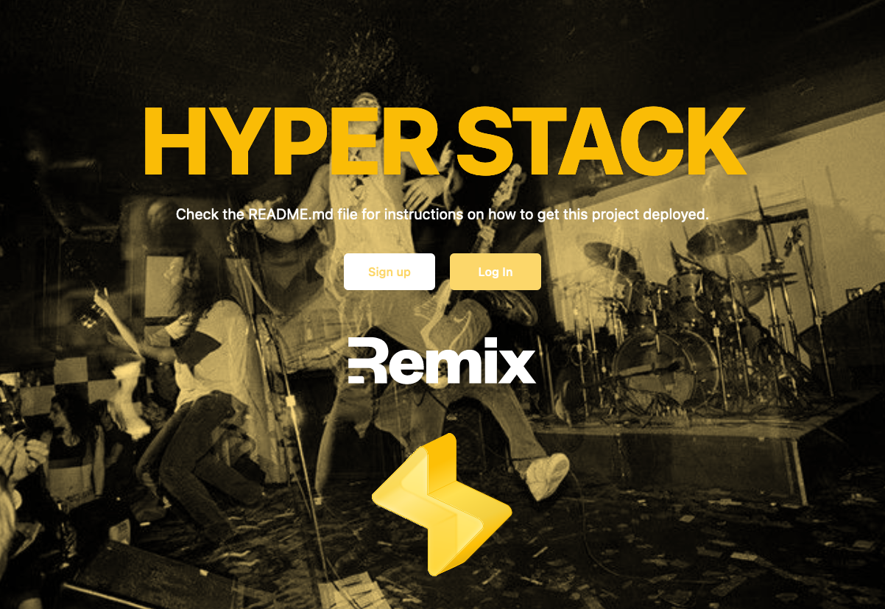

# Remix Hyper Stack



Learn more about [Hyper](https://hyper.io)

Learn more about [Remix Stacks](https://remix.run/stacks).

## Blog Post

Check out
[our blog post](https://blog.hyper.io/introducing-the-remix-hyper-stack/) on the
Remix Hyper Stack

```
npx create-remix --template hyper63/remix-hyper-stack
```

## What's in the stack

- [AWS deployment](https://aws.com) with [Architect](https://arc.codes/)
- [Hyper Cloud](https://hyper.io) integration via
  [`hyper-connect`](https://www.npmjs.com/package/hyper-connect)
- Zero-setup ⚡️ local development using
  [`hyper nano`](https://github.com/hyper63/hyper/tree/main/images/nano)
- [Hyper Vision](https://docs.hyper.io/hyper-vision) support, to peer into your
  hyper services
- [GitPod integration](https://gitpod.io/) for developing in ephermeral cloud
  environments
- [GitHub Actions](https://github.com/features/actions) for deploy on merge to
  production and staging environments
- Email/Password Authentication with
  [cookie-based sessions](https://remix.run/docs/en/v1/api/remix#createcookiesessionstorage)
- Styling with [Tailwind](https://tailwindcss.com/)
- End-to-end testing with [Cypress](https://cypress.io)
- Local third party request mocking with [MSW](https://mswjs.io)
- Unit testing with [Vitest](https://vitest.dev) and
  [Testing Library](https://testing-library.com)
- Code formatting with [Prettier](https://prettier.io)
- Linting with [ESLint](https://eslint.org)
- Static Types with [TypeScript](https://typescriptlang.org)

Not a fan of bits of the stack? Fork it, change it, and use
`npx create-remix --template your/repo`! Make it your own.

## Prerequisites

This Remix stack sets up a local development stack using
[`hyper nano`](https://github.com/hyper63/hyper/tree/main/images/nano) ⚡️ an
in-memory instance of [hyper](https://hyper.io). `hyper nano` works great for
local development or short-lived, ephemeral environments like GitHub Workspaces
or GitPod

> At hyper, we exclusively develop using short-lived ephemeral environments

If you choose **_not_** to use `hyper nano`, you will need to create a
[`hyper cloud application`](https://docs.hyper.io/applications) on
[hyper cloud](https://dashboard.hyper.io):

- Create a free starter account on [hyper cloud](https://dashboard.hyper.io)
- Create a free hyper cloud application. Learn more
  [here](https://docs.hyper.io/applications)
  - The application should at least have a
    [hyper data service](https://docs.hyper.io/data-api)
- Take your application's connection string and use it to set your `HYPER`
  environment variable in your `.env`, during setup. Learn more
  [here](https://docs.hyper.io/app-keys)

## Development

- Start dev server:

  ```sh
  npm run dev
  ```

This starts your app in development mode, rebuilding assets on file changes. All
data will be persisted to your hyper application based on your `HYPER`
connection string environment variable.

### Relevant code:

This is a pretty simple note-taking app, but it's a good example of how you can
build a full stack app with Hyper and Remix, and deploy it using Architect. The
main functionality is creating users, logging in and out, and creating and
deleting notes.

- creating users, finding a user, and deleting a user and their data
  [./app/services/user.server.ts](./app/services/user.server.ts)
- creating, and deleting notes
  [./app/services/note.server.ts](./app/services/note.server.ts)
- user sessions, and verifying them
  [./app/session.server.ts](./app/session.server.ts)

### Gitpod Integration

The Remix Hyper Stack comes with support for cloud based development, using
[GitPod](https://gitpod.io). Just initialize the Remix Hyper Stack using the
Remix CLI, push to Github, and then open in Gitpod by visiting:

```
https://gitpod.io/#your-repo-url
```

> You can also use
> [Gitpod's browser extension](https://www.gitpod.io/docs/browser-extension)

This will build a containerized cloud environment, install dependencies, and
start up your services for you, a complete **sandboxed** environment. We use a
[GitPod `.gitpod.yml`](https://www.gitpod.io/docs/config-gitpod-file) to set up
our Cloud environment and expose our services.

Botch a feature and need to wipe the data? Just open a new Gitpod!

Need to fix a bug? Create an issue and then
[open the issue in Gitpod](https://www.gitpod.io/docs/context-urls)!

With Gitpod, you no longer have to maintain a local environment. Just spin up a
new one every time!

### Hyper Sevice Vision 🕶

If you'd like to see what is being stored in your hyper services, you can use
[Hyper Vision](https://docs.hyper.io/hyper-vision) to peer into your services.

Hyper Vision is a hosted, read-only, hyper service explorer that you can use to
view your services. Just provide Hyper Vision with your application's hyper
connection string (`process.env.HYPER`) and it will introspect your services!

> If you're running `hyper nano` locally, you will need to use a proxy to make
> it accessible on the internet. [ngrok](https://ngrok.com/) is a great tool for
> this (though if you develop in ephemeral cloud environments like Gitpod, you
> get this out of the box 😎).

## Clean Architecture With Hyper

Hyper embraces the
[Clean Architecture](https://blog.hyper.io/the-perfect-application-architecture/)
approach to building software. This means separating side effects from business
logic and striving to keep business logic separated from other details of the
application.

This has lots of benefits:

- Business logic is _framework_ agnostic
- Business logic is _infrastructure_ agnostic
- Easier to test business logic (unit tests and TypeScript cover most of it!)
- Separation of concerns

**All of the business logic for this application can be found in
[./app/services](./app/services)**. Each service receives its side effects via
[dependency injection](https://martinfowler.com/articles/refactoring-dependencies.html#DependencyInjection)
which are then easy to stub during unit testing.

Our business `models` are simple schemas built on
[zod](https://github.com/colinhacks/zod) used to validate the correctness of
data flowing in and out of our business logic layer.

> You could use anything to validate the contracts with your business logic, I
> chose `zod` because it's what we use at hyper. `Joi`, `Yup`, there are tons of
> options out there.

Because all side effects are injected via dependency injection, the business
logic is incredibly easy to test. The business logic is practically fully tested
using **just unit tests**. (run `npm run test --coverage` to see for yourself)

You can also see dependency injection in [./server.ts](./server.ts), which uses
Remix's
[`getLoadContext`](https://remix.run/docs/en/v1/other-api/adapter#createrequesthandler)
to inject our business services and session handling into our `loaders` and
`actions`, via `context`.

Learn more
[from our blog post](https://blog.hyper.io/introducing-the-remix-hyper-stack/#cleanarchitecturewithhyper)

## Deployment

This Remix Stack comes with two GitHub Actions that handle automatically
deploying your app to production and staging environments. By default, Arc will
deploy to the `us-west-2` region, if you wish to deploy to a different region,
you'll need to change your
[`app.arc`](https://arc.codes/docs/en/reference/project-manifest/aws)

Alternatively, you can set `AWS_REGION` in
[your GitHub repo's secrets](https://docs.github.com/en/actions/security-guides/encrypted-secrets)

### Hyper Setup

Each environment will need a hyper cloud application backing it. Since this
stack has a `staging` and `production` environment, you will need a hyper cloud
application for `staging` and then another for `production` (you get 3 hyper
cloud applications for **free**, and you can always upgrade them later). Learn
more [here](https://docs.hyper.io/subscriptions).

Once the hyper applications have been created, set the `HYPER` environment
variable in `production` and `staging` environments using Arc:

```sh
npx arc env --add --env staging HYPER cloud://....
npx arc env --add --env production HYPER cloud://....
```

> Alternatively, you can set `HYPER` for `staging` and `production` via
> [your GitHub repo's secrets](https://docs.github.com/en/actions/security-guides/encrypted-secrets)
> as part of CI.
> [See the `deploy` step in your `deploy` workflow](./.github/workflows/deploy.yml)

### Architect Setup

Prior to your first deployment, you'll need to do a few things:

- [Sign up](https://portal.aws.amazon.com/billing/signup#/start) and login to
  your AWS account

- Add `AWS_ACCESS_KEY_ID` and `AWS_SECRET_ACCESS_KEY` and `AWS_REGION` to
  [your GitHub repo's secrets](https://docs.github.com/en/actions/security-guides/encrypted-secrets).
  Go to your AWS
  [security credentials](https://console.aws.amazon.com/iam/home?region=us-west-2#/security_credentials)
  and click on the "Access keys" tab, and then click "Create New Access Key",
  then you can copy those and add them to your repo's secrets.

- Along with your AWS credentials, you'll also need to give your CloudFormation
  a `SESSION_SECRET` variable of its own for both staging and production
  environments, as well as an `ARC_APP_SECRET` for Arc itself.

  ```sh
  npx arc env --add --env staging ARC_APP_SECRET $(openssl rand -hex 32)
  npx arc env --add --env staging SESSION_SECRET $(openssl rand -hex 32)
  npx arc env --add --env production ARC_APP_SECRET $(openssl rand -hex 32)
  npx arc env --add --env production SESSION_SECRET $(openssl rand -hex 32)
  ```

  > Alternatively, you can generate and set `ARC_APP_SECRET` and
  > `SESSION_SECRET` via
  > [your GitHub repo's secrets](https://docs.github.com/en/actions/security-guides/encrypted-secrets)
  > as part of CI.
  > [See the `deploy` step in your `deploy` workflow](./.github/workflows/deploy.yml)

  If you don't have openssl installed, you can also use
  [1password](https://1password.com/password-generator) to generate a random
  secret, just replace `$(openssl rand -hex 32)` with the generated secret.

### Where do I find my CloudFormation?

You can find the CloudFormation template that Architect generated for you in the
sam.yaml file.

To find it on AWS, you can search for
[CloudFormation](https://console.aws.amazon.com/cloudformation/home) (make sure
you're looking at the correct region!) and find the name of your stack (the name
is a PascalCased version of what you have in `app.arc`, so by default it's
RemixHyperStackStaging and RemixHyperStackProduction) that matches what's in
`app.arc`, you can find all of your app's resources under the "Resources" tab.

## GitHub Actions

We use GitHub Actions for continuous integration and deployment. Anything that
gets into the `main` branch will be deployed to production after running
tests/build/etc. Anything in the `dev` branch will be deployed to staging.

## Testing

### Cypress

We use Cypress for our End-to-End tests in this project. You'll find those in
the `cypress` directory. As you make changes, add to an existing file or create
a new file in the `cypress/e2e` directory to test your changes.

We use [`@testing-library/cypress`](https://testing-library.com/cypress) for
selecting elements on the page semantically.

To run these tests in development, run `npm run test:e2e:dev` which will start
the dev server for the app as well as the Cypress client. Make sure the database
is running in docker as described above.

We have a utility for testing authenticated features without having to go
through the login flow:

```ts
cy.login();
// you are now logged in as a new user
```

We also have a utility to auto-delete the user at the end of your test. Just
make sure to add this in each test file:

```ts
afterEach(() => {
  cy.cleanupUser();
});
```

That way, we can keep your local db clean and keep your tests isolated from one
another.

### Vitest

For lower level tests of utilities and individual components, we use `vitest`.
We have DOM-specific assertion helpers via
[`@testing-library/jest-dom`](https://testing-library.com/jest-dom).

### Type Checking

This project uses TypeScript. It's recommended to get TypeScript set up for your
editor to get a really great in-editor experience with type checking and
auto-complete. To run type checking across the whole project, run
`npm run typecheck`.

### Linting

This project uses ESLint for linting. That is configured in `.eslintrc.js`.

### Formatting

We use [Prettier](https://prettier.io/) for auto-formatting in this project.
It's recommended to install an editor plugin (like the
[VSCode Prettier plugin](https://marketplace.visualstudio.com/items?itemName=esbenp.prettier-vscode))
to get auto-formatting on save. There's also a `npm run format` script you can
run to format all files in the project.

## Thank You

We at hyper are very excited about Remix and Remix stacks. A huge shout out to
the [Remix team](https://remix.run/) and to
[Kent C. Dodds](https://kentcdodds.com/) for showing us this cool new feature.

Also thank you to the all the maintainers of open source projects that we use.
In particular:

- [Architect](https://arc.codes)
- [Zod](https://github.com/colinhacks/zod)
- [Ramda](https://ramdajs.com/)
- [Vitest](https://vitest.dev/)
- [Tailwind](https://tailwindcss.com/)

and many many more!
